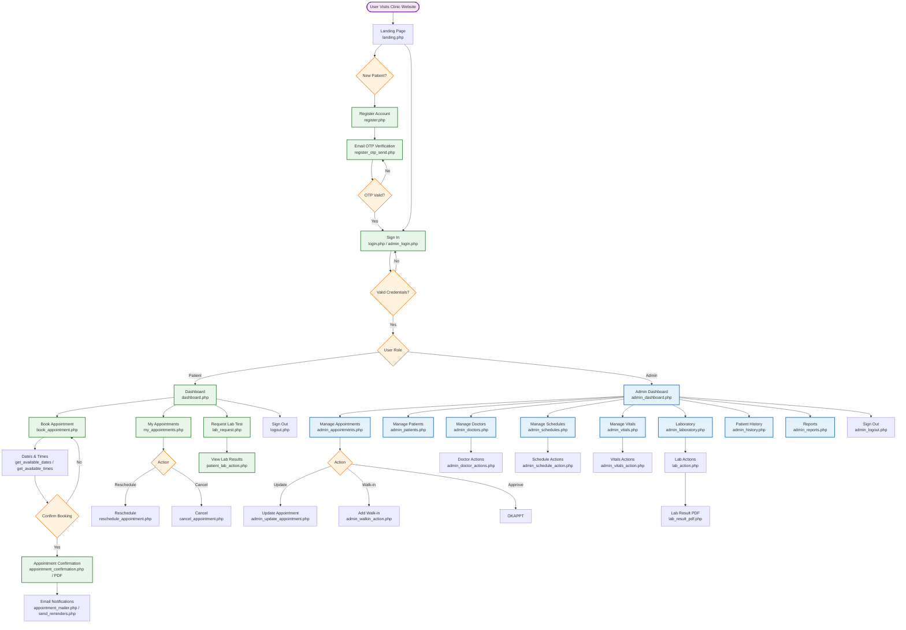

# LUSTRE MEDICAL DIAGNOSTIC CLINIC — System Flowchart

## Full System Overview

## How to view this flowchart

This file uses **Mermaid**. To render it:

- **VS Code**: install the "Markdown Preview Mermaid Support" extension, then open the preview.
- **Online**: paste the `mermaid` block into https://mermaid.live
- **GitHub**: markdown `.md` files with mermaid blocks render automatically.

---

## Flow Summary

1. **Entry** — User lands on `landing.php`, either signs in or registers (with email OTP).
2. **Role split** — After login, the system routes patients to `dashboard.php` and admins to `admin_dashboard.php`.
3. **Patient** — Books/reschedules/cancels appointments, views confirmation slips, requests lab tests and views results.
4. **Admin** — Manages appointments (incl. walk-ins), patients, doctors, schedules, vitals, the lab, patient history, and generates reports.
5. **Notifications** — Email confirmations/reminders are sent via `appointment_mailer.php` / `send_reminders.php`.
